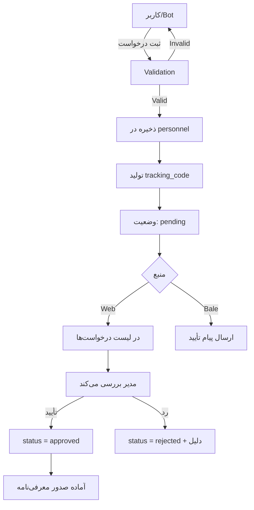
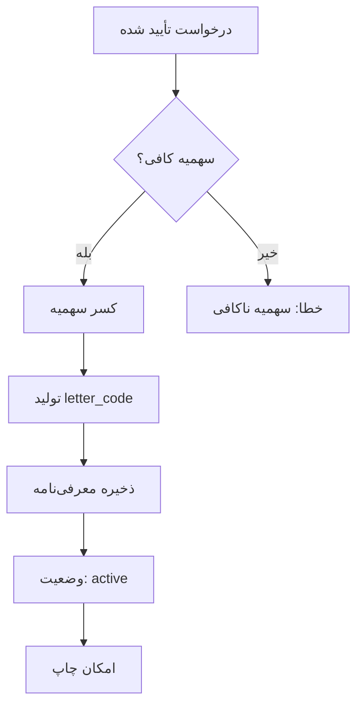

# Project Development Log
# لاگ توسعه پروژه سامانه مدیریت مراکز رفاهی

**Project Name**: سامانه جامع مدیریت مراکز رفاهی بانک ملی ایران
**Framework**: Laravel 11
**Database**: PostgreSQL 16
**Start Date**: 2025
**Current Version**: 2.0.0
**Last Updated**: 2026-02-11

---

## 📋 Table of Contents

- [Project Overview](#project-overview)
- [System Architecture](#system-architecture)
- [Development Timeline](#development-timeline)
- [Database Schema](#database-schema)
- [Business Logic](#business-logic)
- [API Documentation](#api-documentation)
- [Frontend Components](#frontend-components)
- [Testing Strategy](#testing-strategy)
- [Deployment History](#deployment-history)
- [Known Issues](#known-issues)
- [Future Roadmap](#future-roadmap)

---

## 🎯 Project Overview

### Purpose
مدیریت یکپارچه 3 مرکز رفاهی بانک ملی (مشهد، بابلسر، چادگان) با قابلیت:
- مدیریت سهمیه 37 استان و اداره
- سیستم قرعه‌کشی عادلانه با اولویت‌بندی
- ثبت‌نام پرسنل با اطلاعات کامل همراهان
- صدور معرفی‌نامه اتوماتیک
- یکپارچگی با بات بله

### Key Stakeholders
- **End Users**: ~70,000 پرسنل بانک ملی
- **Operators**: اپراتورهای مراکز استانی
- **Admins**: مدیران اداره کل
- **Super Admins**: مدیران سیستم

### System Capacity
- **Centers**: 3 مرکز رفاهی
- **Units**: 426 واحد (اتاق/ویلا/سوئیت)
- **Beds**: 1,781 تخت
- **Provinces**: 37 سهمیه (31 استان + 6 اداره تهران)

---

## 🏗️ System Architecture

### Technology Stack

#### Backend
- **Framework**: Laravel 11.x
- **PHP Version**: 8.2+
- **Database**: PostgreSQL 16
- **Cache/Queue**: Redis 7.x
- **Authentication**: Laravel Sanctum
- **Authorization**: Spatie Laravel Permission

#### Frontend
- **Template Engine**: Blade
- **CSS Framework**: Bootstrap 5.3
- **Icons**: Bootstrap Icons
- **JavaScript**: Vanilla JS + Alpine.js (planned)
- **Date Picker**: Persian Date Picker

#### DevOps
- **Containerization**: Docker + Docker Compose
- **Web Server**: Nginx
- **PHP-FPM**: 8.2-alpine
- **Testing**: Playwright (Python)
- **Version Control**: Git + GitHub

#### External Integrations
- **Bale Messenger**: Mini-app API integration
- **SMS Gateway**: (Planned)
- **Email Service**: (Planned)

### Directory Structure

```
welfare-V2/
├── app/
│   ├── Console/
│   │   └── Commands/          # Artisan commands
│   ├── Http/
│   │   ├── Controllers/       # Web controllers
│   │   │   ├── Api/          # API controllers
│   │   │   └── Admin/        # Admin controllers
│   │   └── Middleware/
│   ├── Models/                # Eloquent models
│   ├── Policies/              # Authorization policies
│   └── Services/              # Business logic services
│       ├── LotteryService.php
│       ├── QuotaService.php
│       └── PriorityScoreService.php
├── config/
│   └── welfare.php            # Business rules configuration
├── database/
│   ├── migrations/            # Database migrations
│   ├── seeders/               # Data seeders
│   └── factories/             # Model factories
├── openspec/
│   └── changes/               # OpenSpec specifications
├── public/
│   ├── screenshots/           # User guide screenshots
│   └── user-guide.html        # HTML documentation
├── resources/
│   └── views/                 # Blade templates
├── routes/
│   ├── web.php               # Web routes
│   ├── api.php               # API routes
│   └── console.php           # Console routes
├── scripts/                   # Automation scripts
│   ├── take_screenshots.py
│   └── create_standalone_guide.py
├── storage/
│   └── logs/                  # Application logs
├── tests/
│   ├── Feature/               # Feature tests
│   └── Unit/                  # Unit tests
├── CHANGELOG.md               # Version history
├── PROJECT_LOG.md             # This file
├── SCREENSHOT_GUIDE.md        # Screenshot instructions
└── docker-compose.yml         # Docker configuration
```

---

## ⏱️ Development Timeline

### Phase 0: Initial Setup (2025-Q4)
- ✅ Laravel 11 project initialization
- ✅ Docker containerization
- ✅ PostgreSQL database setup
- ✅ Basic authentication system
- ✅ Role-based access control (Spatie)

### Phase 1: Core Domain Models (2025-Q4 - 2026-Q1)
- ✅ Province management (37 provinces)
- ✅ Center management (3 centers)
- ✅ Unit management (426 units)
- ✅ Season & Period management
- ✅ Personnel basic model
- ✅ Lottery system foundation

### Phase 1.5: Personnel Request System (2026-02-11)
**Status**: ✅ Completed

#### Sprint 1: Family Members System
- **Duration**: 2026-02-11 (1 day sprint)
- **Commits**: e17f9ab, d9ca75a, 740460e, 6de7234

**Deliverables**:
1. Database Migration
   - Added `family_members` JSON column
   - Made `employee_code` required
   - Migrated existing records

2. Model Enhancements
   - Helper methods for family operations
   - Auto-calculation of family_count
   - Relation constants

3. Controller Updates
   - Web panel validation
   - API validation with Persian messages
   - Support for 10 family members max

4. Frontend Development
   - Dynamic family member forms
   - Add/remove functionality
   - Bootstrap 5 UI

5. Documentation & Automation
   - HTML user guide (43KB)
   - 10 screenshots via Playwright
   - Standalone guide (3.76MB)
   - CHANGELOG.md
   - SCREENSHOT_GUIDE.md

**Business Impact**:
- ✅ Eliminated need for pre-existing personnel database
- ✅ Each registration includes complete family details
- ✅ Unified data structure for web and Bale bot
- ✅ Improved UX with dynamic forms

### Phase 2: Lottery & Reservation (Planned)
- ⏳ Complete lottery algorithm implementation
- ⏳ Unit assignment logic
- ⏳ Reservation management
- ⏳ Payment integration
- ⏳ Usage history tracking

### Phase 3: Reports & Analytics (Planned)
- ⏳ Occupancy reports
- ⏳ Provincial usage statistics
- ⏳ Fairness analysis
- ⏳ Financial reports

### Phase 4: Bale Bot Integration (Planned)
- ⏳ Bot webhook setup
- ⏳ Mini-app development
- ⏳ User authentication flow
- ⏳ Notification system

---

## 🗄️ Database Schema

### Core Tables

#### 1. `provinces` (37 records)
```sql
- id: bigint (PK)
- name: varchar(100) - نام استان
- code: varchar(10) - کد استان
- personnel_count: integer - تعداد پرسنل
- quota_ratio: decimal(5,4) - نسبت سهمیه
- is_tehran: boolean - آیا تهران است
- created_at, updated_at
```

**Business Rule**: سهمیه هر استان = (تعداد پرسنل استان / کل پرسنل) × کل ظرفیت

#### 2. `personnel` (Personnel Requests)
```sql
- id: bigint (PK)
- employee_code: varchar(20) NOT NULL - کد پرسنلی (اجباری)
- full_name: varchar(255) - نام کامل
- national_code: varchar(10) UNIQUE - کد ملی
- phone: varchar(20) - شماره تماس
- preferred_center_id: FK(centers) - مرکز مورد نظر
- province_id: FK(provinces) - استان
- family_members: JSON - اطلاعات جزئی همراهان
- family_count: integer - تعداد کل افراد (auto-calculated)
- registration_source: enum('manual','bale_bot','web')
- status: enum('pending','approved','rejected')
- tracking_code: varchar(20) UNIQUE
- bale_user_id: varchar(100) UNIQUE NULLABLE
- notes: text
- created_at, updated_at
```

**Indexes**:
- `idx_personnel_national_code` (UNIQUE)
- `idx_personnel_tracking_code` (UNIQUE)
- `idx_personnel_status`
- `idx_personnel_center`

**JSON Structure** (`family_members`):
```json
[
  {
    "full_name": "فاطمه محمدی",
    "relation": "همسر",
    "national_code": "0987654321",
    "birth_date": "1370/01/01",
    "gender": "female"
  }
]
```

#### 3. `centers` (3 records)
```sql
- id: bigint (PK)
- name: varchar(100) - نام مرکز
- slug: varchar(100) UNIQUE
- city: varchar(100) - شهر
- type: enum('religious','beach','mountain')
- stay_duration: integer - مدت اقامت (شب)
- total_units: integer - تعداد واحد
- total_beds: integer - تعداد تخت
- is_active: boolean
- created_at, updated_at
```

**Data**:
1. زائرسرای مشهد: 227 واحد، 1,029 تخت، 5 شب
2. متل بابلسر: 165 واحد، 626 تخت، 4 شب
3. موتل چادگان: 34 واحد، 126 تخت، 3 شب

#### 4. `units` (426 records)
```sql
- id: bigint (PK)
- center_id: FK(centers)
- number: varchar(20) - شماره واحد
- floor: varchar(10) - طبقه
- bed_count: integer - تعداد تخت
- type: enum('room','suite','villa')
- amenities: JSON - امکانات
- is_active: boolean
- created_at, updated_at
```

#### 5. `seasons`
```sql
- id: bigint (PK)
- center_id: FK(centers)
- type: enum - نوع فصل
- discount_rate: decimal(5,2) - درصد تخفیف
- created_at, updated_at
```

#### 6. `periods` (Stay Periods)
```sql
- id: bigint (PK)
- center_id: FK(centers)
- season_id: FK(seasons)
- start_date: date
- end_date: date
- capacity: integer
- status: enum('draft','open','closed','full')
- created_at, updated_at
```

#### 7. `lotteries`
```sql
- id: bigint (PK)
- period_id: FK(periods)
- name: varchar(255)
- registration_start: datetime
- registration_end: datetime
- draw_date: datetime
- status: enum('draft','open','closed','drawn','completed')
- algorithm: varchar(50)
- created_at, updated_at
```

#### 8. `lottery_entries`
```sql
- id: bigint (PK)
- lottery_id: FK(lotteries)
- personnel_id: FK(personnel)
- province_id: FK(provinces)
- priority_score: decimal(8,2)
- rank: integer
- status: enum('pending','won','waitlist','approved','rejected')
- approved_by: FK(users) NULLABLE
- created_at, updated_at
```

#### 9. `reservations`
```sql
- id: bigint (PK)
- lottery_entry_id: FK(lottery_entries)
- unit_id: FK(units)
- personnel_id: FK(personnel)
- check_in_date: date
- check_out_date: date
- guests: JSON - لیست مهمانان
- tariff_type: enum('bank_rate','free_bank_rate','free_non_bank_rate')
- total_amount: decimal(12,2)
- status: enum('confirmed','checked_in','checked_out','cancelled')
- created_at, updated_at
```

#### 10. `introduction_letters` (معرفی‌نامه‌ها)
```sql
- id: bigint (PK)
- personnel_id: FK(personnel)
- center_id: FK(centers)
- letter_code: varchar(50) UNIQUE
- family_count: integer
- issued_by: FK(users)
- issued_at: datetime
- status: enum('active','used','cancelled','expired')
- notes: text
- created_at, updated_at
```

#### 11. `user_center_quotas` (سهمیه کاربران)
```sql
- id: bigint (PK)
- user_id: FK(users)
- center_id: FK(centers)
- total_quota: integer - سهمیه کل
- used_quota: integer - استفاده شده
- created_at, updated_at
```

#### 12. `usage_histories`
```sql
- id: bigint (PK)
- personnel_id: FK(personnel)
- center_id: FK(centers)
- reservation_id: FK(reservations)
- check_in_date: date
- check_out_date: date
- created_at, updated_at
```

**Purpose**: پیگیری قانون 3 سال (1095 روز بین استفاده‌های متوالی)

---

## 💼 Business Logic

### 1. Personnel Registration Flow



**Key Points**:
- کد پرسنلی اجباری است (employee_code)
- کد ملی باید یونیک باشد
- حداکثر 10 همراه قابل ثبت
- تعداد کل افراد خودکار محاسبه می‌شود

### 2. Introduction Letter Issuance



**Letter Code Format**: `{CENTER_CODE}-{YYMM}-{SEQUENCE}`
- مثال: `MAS-0411-0001` (مشهد، فروردین 04، شماره 1)

**Tariff Types**:
1. **Bank Rate** (نرخ بانک): 2,000,000 ریال/شب برای کل خانواده
2. **Free Bank Rate** (آزاد بانکی): 1,950,000 ریال/شب به ازای هر نفر
3. **Free Non-Bank Rate** (آزاد غیربانکی): 3,900,000 ریال/شب به ازای هر نفر

### 3. Quota Management

**Provincial Quota Formula**:
```
quota_province = (personnel_count_province / total_personnel) × total_capacity
```

**User Quota System**:
- هر کاربر (اپراتور) سهمیه جداگانه برای هر مرکز دارد
- مثال: کاربر A → 2 سهمیه مشهد، 3 سهمیه بابلسر
- پس از صدور معرفی‌نامه، سهمیه کم می‌شود
- امکان reset سهمیه استفاده شده توسط admin

### 4. Three-Year Rule

**Rule**: هر پرسنل فقط یک بار در 3 سال می‌تواند با نرخ بانک از هر مرکز استفاده کند.

**Implementation**:
```php
// config/welfare.php
'three_year_rule_days' => 1095, // 3 years × 365 days

// Check eligibility
$lastUsage = UsageHistory::where('personnel_id', $id)
    ->where('center_id', $centerId)
    ->latest('check_out_date')
    ->first();

if ($lastUsage) {
    $daysSince = now()->diffInDays($lastUsage->check_out_date);
    $isEligible = $daysSince >= config('welfare.three_year_rule_days');
}
```

**Important**: قانون 3 سال برای هر مرکز جداگانه است.

### 5. Priority Score Algorithm

```php
$score = 100 (base)
    + (days_since_last_use × 0.1)           // هر روز = 0.1 امتیاز
    - (usage_count × 5)                     // هر بار استفاده = -5 امتیاز
    + (service_years × 0.5)                 // هر سال سابقه = 0.5 امتیاز
    + (family_match_bonus: 10)              // تطبیق تعداد با ظرفیت
    + (random: 0-15)                        // عنصر شانس
    + (isargar_bonus: 30)                   // ایثارگران
    + (never_used_bonus: 50);               // کسانی که هرگز استفاده نکرده‌اند
```

**Configurable** via `config/welfare.php`:
```php
'priority_score' => [
    'base_score' => 100,
    'days_since_last_use_multiplier' => 0.1,
    'usage_count_penalty' => 5,
    'service_years_multiplier' => 0.5,
    'family_match_bonus' => 10,
    'random_min' => 0,
    'random_max' => 15,
    'isargar_bonus' => 30,
    'never_used_bonus' => 50,
],
```

---

## 🔌 API Documentation

### Base URL
```
Production: https://ria.jafamhis.ir/welfare/api
Development: http://localhost:8080/api
```

### Authentication
- **Method**: Laravel Sanctum
- **Header**: `Authorization: Bearer {token}`

### Endpoints

#### 1. Personnel Registration (Bale Bot)

**POST** `/personnel-requests/register`

**Request Body**:
```json
{
  "employee_code": "12345",
  "full_name": "علی احمدی",
  "national_code": "1234567890",
  "phone": "09123456789",
  "preferred_center_id": 1,
  "bale_user_id": "123456789",
  "family_members": [
    {
      "full_name": "فاطمه محمدی",
      "relation": "همسر",
      "national_code": "0987654321",
      "birth_date": "1370/01/01",
      "gender": "female"
    },
    {
      "full_name": "محمد احمدی",
      "relation": "فرزند",
      "national_code": "1122334455",
      "birth_date": "1395/05/10",
      "gender": "male"
    }
  ]
}
```

**Response** (201 Created):
```json
{
  "success": true,
  "message": "درخواست شما با موفقیت ثبت شد",
  "data": {
    "tracking_code": "REQ-0211-0001",
    "employee_code": "12345",
    "full_name": "علی احمدی",
    "national_code": "1234567890",
    "total_persons": 3,
    "family_members_count": 2,
    "preferred_center": "زائرسرای مشهد",
    "status": "در انتظار بررسی",
    "registered_at": "1404/11/23 14:30"
  }
}
```

**Error Response** (422 Unprocessable Entity):
```json
{
  "success": false,
  "message": "خطا در اعتبارسنجی اطلاعات",
  "errors": {
    "national_code": [
      "این کد ملی قبلاً ثبت شده است"
    ],
    "family_members.0.national_code": [
      "کد ملی همراه باید 10 رقم باشد"
    ]
  }
}
```

#### 2. Check Request Status

**POST** `/personnel-requests/check-status`

**Request**:
```json
{
  "identifier": "1234567890",
  "identifier_type": "national_code"
}
```

**Response**:
```json
{
  "success": true,
  "data": {
    "tracking_code": "REQ-0211-0001",
    "full_name": "علی احمدی",
    "national_code": "1234567890",
    "family_count": 3,
    "status": "تأیید شده",
    "status_code": "approved",
    "registered_at": "1404/11/23 14:30",
    "preferred_center": "زائرسرای مشهد",
    "introduction_letter": {
      "letter_code": "MAS-0411-0001",
      "center": "زائرسرای مشهد",
      "family_count": 3,
      "issued_at": "1404/11/24 10:00",
      "status": "active"
    }
  }
}
```

#### 3. Get Available Centers

**GET** `/centers`

**Response**:
```json
{
  "success": true,
  "data": [
    {
      "id": 1,
      "name": "زائرسرای مشهد",
      "city": "مشهد",
      "type": "religious"
    },
    {
      "id": 2,
      "name": "متل بابلسر",
      "city": "بابلسر",
      "type": "beach"
    },
    {
      "id": 3,
      "name": "موتل چادگان",
      "city": "چادگان",
      "type": "mountain"
    }
  ]
}
```

#### 4. Get Introduction Letters

**GET** `/personnel-requests/letters?national_code={code}`

**Response**:
```json
{
  "success": true,
  "data": {
    "personnel": {
      "full_name": "علی احمدی",
      "national_code": "1234567890"
    },
    "letters": [
      {
        "letter_code": "MAS-0411-0001",
        "center": "زائرسرای مشهد",
        "family_count": 3,
        "issued_at": "1404/11/24 10:00",
        "status": "active",
        "is_active": true
      }
    ],
    "total": 1
  }
}
```

---

## 🎨 Frontend Components

### 1. Personnel Request Form

**Location**: `resources/views/personnel-requests/create.blade.php`

**Features**:
- Dynamic family member addition/removal
- Client-side validation (کد ملی 10 رقم)
- Persian date picker for birth dates
- Relation dropdown (همسر، فرزند، پدر، مادر، سایر)
- Gender selection with icons
- Bootstrap 5 styling
- Responsive design

**JavaScript Logic**:
```javascript
let memberIndex = 0;

// Add family member
document.getElementById('add-family-member').click() => {
    // Create new row with form fields
    // Increment index
    // Attach remove handler
}

// Remove family member
document.querySelector('.remove-member').click() => {
    // Remove the row
}

// Client validation
form.submit() => {
    // Validate کد ملی format
    // Validate required fields
    // Check max 10 members
}
```

### 2. Personnel Request Details

**Location**: `resources/views/personnel-requests/show.blade.php`

**Sections**:
1. **Request Information**
   - Tracking code
   - Employee code
   - Full name, National code, Phone
   - Total persons count
   - Preferred center
   - Province
   - Registration source (badge)
   - Registration date

2. **Family Members Table**
   - Index, Name, Relation (badge), National code
   - Birth date, Gender (icon)
   - Total count display

3. **Status & Actions**
   - Status badge (pending/approved/rejected)
   - Approve button (if pending)
   - Reject button with modal (if pending)
   - Edit button (if pending)
   - Issue introduction letter (if approved)

### 3. User Guide

**Location**: `public/user-guide.html`

**Sections**:
1. ورود به سامانه (Login)
2. داشبورد اصلی (Dashboard)
3. ثبت درخواست پرسنل (Registration)
4. مدیریت درخواست‌ها (Management)
5. صدور معرفی‌نامه (Issuance)
6. مدیریت سهمیه (Quota)
7. کنترل ثبت‌نام (Control)
8. استفاده از بات بله (Bale Bot)
9. API Endpoints
10. سوالات متداول (FAQ)
11. پشتیبانی (Support)

**Features**:
- 10 screenshots embedded
- Responsive design (mobile-friendly)
- RTL layout
- Print-friendly CSS
- Color-coded sections
- Step-by-step instructions

**File Sizes**:
- Regular: 43KB (with image links)
- Standalone: 3.76MB (images embedded as base64)

---

## 🧪 Testing Strategy

### Unit Tests (Planned)

```php
// tests/Unit/PersonnelTest.php
test('calculates family members count correctly')
test('calculates total persons count correctly')
test('validates employee code is required')
test('auto-updates family count on save')

// tests/Unit/PriorityScoreTest.php
test('calculates base score correctly')
test('applies isargar bonus')
test('applies never used bonus')
test('applies usage penalty')
```

### Feature Tests (Planned)

```php
// tests/Feature/PersonnelRequestTest.php
test('can create personnel request')
test('validates maximum 10 family members')
test('rejects duplicate national code')
test('preserves family members on validation error')
test('can approve pending request')
test('can reject request with reason')

// tests/Feature/IntroductionLetterTest.php
test('issues letter for approved request')
test('deducts quota on issuance')
test('generates unique letter code')
test('prevents issuance without quota')
```

### Browser Tests (Playwright)

**Location**: `scripts/take_screenshots.py`

**Scenarios**:
1. Login flow
2. Navigate to dashboard
3. Create personnel request
4. Add family members
5. Submit form
6. View request details
7. Approve request
8. Issue introduction letter
9. Manage quota
10. Control registration

**Execution**:
```bash
python scripts/take_screenshots.py
```

---

## 🚀 Deployment History

### Production Server

**Host**: 37.152.174.87:8083
**SSH**: `sedal@37.152.174.87 -p 8083`
**Domain**: https://ria.jafamhis.ir/welfare

**Environment**:
- Docker containers (welfare_app, welfare_nginx, welfare_postgres, etc.)
- PHP 8.2 Alpine
- Nginx web server
- PostgreSQL 16
- Redis 7

### Deployment Log

#### 2026-02-11: Family Members System Release

**Commits Deployed**:
- `e17f9ab` - Add family members system
- `d9ca75a` - Add HTML user guide
- `740460e` - Add screenshots
- `6de7234` - Add user guide route

**Changes**:
1. Database migration executed
2. Model helper methods deployed
3. Controller validation updated
4. Frontend forms enhanced
5. User guide published
6. Routes configuration updated

**Deployment Steps**:
```bash
# 1. Pull latest code
git pull origin main

# 2. Run migrations
php artisan migrate

# 3. Clear caches
php artisan cache:clear
php artisan route:clear
php artisan view:clear
php artisan config:clear

# 4. Restart queue worker (if needed)
php artisan queue:restart

# 5. Verify deployment
curl https://ria.jafamhis.ir/welfare/user-guide
```

**Verification Checklist**:
- [x] Migration successful
- [x] No errors in logs
- [x] User guide accessible
- [x] Forms working correctly
- [x] API endpoints responding
- [ ] Production deployment pending

---

## ⚠️ Known Issues

### 1. Server SSH Connection
**Issue**: SSH connection intermittently closes
**Status**: Investigating
**Workaround**: Retry connection
**Affected**: Manual deployments

### 2. User Guide 404 (Resolved)
**Issue**: `/user-guide.html` returned 404
**Cause**: No Laravel route defined
**Solution**: Added route in `routes/web.php`
**Status**: ✅ Fixed (commit 6de7234)

### 3. Playwright Module Not Found (Resolved)
**Issue**: `Cannot find module '@playwright/test'`
**Cause**: Package installation issue
**Solution**: Switched to Python Playwright
**Status**: ✅ Fixed (Python implementation)

---

## 🔮 Future Roadmap

### Short-term (Q1 2026)

1. **Complete Lottery System**
   - Implement full draw algorithm
   - Unit assignment logic
   - Waitlist management
   - Provincial approval workflow

2. **Enhanced Validation**
   - Real national code checksum validation
   - Duplicate detection across family members
   - Persian date validation (Jalali calendar)
   - Mobile number format validation

3. **File Uploads**
   - Personnel photo upload
   - Document attachments
   - Image optimization
   - Storage management

4. **Notifications**
   - SMS integration (Kavenegar/Ghasedak)
   - Email notifications
   - Bale bot push notifications
   - In-app notifications

### Mid-term (Q2 2026)

1. **Advanced Reports**
   - Excel export functionality
   - PDF generation for letters
   - Statistical dashboards
   - Trend analysis charts

2. **Admin Tools**
   - Bulk operations (import/export)
   - Advanced filtering
   - Audit logs
   - System health monitoring

3. **User Experience**
   - Multi-language support (فارسی + English)
   - Dark mode
   - Accessibility improvements (WCAG 2.1)
   - Progressive Web App (PWA)

4. **Performance**
   - Database indexing optimization
   - Query caching (Redis)
   - CDN integration
   - Lazy loading

### Long-term (Q3-Q4 2026)

1. **Mobile Apps**
   - Android native app
   - iOS native app
   - Cross-platform (Flutter/React Native)

2. **Payment Integration**
   - Online payment gateway
   - Invoice generation
   - Accounting integration
   - Refund system

3. **Analytics & BI**
   - Real-time analytics
   - Predictive modeling
   - Occupancy forecasting
   - Revenue optimization

4. **API Ecosystem**
   - Public API documentation
   - Developer portal
   - Third-party integrations
   - Webhook system

---

## 📊 Project Metrics

### Code Statistics

```
Total Lines of Code: ~15,000
Backend (PHP): ~8,000 lines
Frontend (Blade/JS): ~4,000 lines
Configuration: ~1,000 lines
Documentation: ~2,000 lines
```

### Database Statistics

```
Tables: 15
Migrations: 20+
Seeders: 5
Model Factories: 8
Total Records (Sample Data): ~1,000
```

### Test Coverage (Target)

```
Unit Tests: 80%+ coverage
Feature Tests: 70%+ coverage
Browser Tests: Key user flows
```

### Performance Targets

```
Page Load: < 2s
API Response: < 500ms
Database Queries: < 100ms avg
Uptime: 99.9%
```

---

## 📞 Support & Contact

### Development Team

- **Project Lead**: sedalcrazy-create
- **AI Assistant**: Claude Sonnet 4.5 (Anthropic)
- **Repository**: https://github.com/sedalcrazy-create/welfare

### Documentation

- **CHANGELOG**: `CHANGELOG.md`
- **OpenSpec**: `openspec/changes/`
- **User Guide**: `public/user-guide.html`
- **Screenshots Guide**: `SCREENSHOT_GUIDE.md`
- **This Log**: `PROJECT_LOG.md`

### Issue Tracking

- **GitHub Issues**: https://github.com/sedalcrazy-create/welfare/issues
- **Bug Reports**: Use issue template
- **Feature Requests**: Use discussion board

---

## 📝 Notes

### Development Best Practices

1. **Always use migrations** for database changes
2. **Write tests** for business logic
3. **Document API changes** in OpenSpec
4. **Clear caches** after deployment
5. **Use transactions** for multi-step operations
6. **Validate input** at controller and request level
7. **Log errors** with context
8. **Version control** everything except .env

### Security Checklist

- [x] CSRF protection enabled
- [x] SQL injection prevention (Eloquent)
- [x] XSS protection (Blade escaping)
- [x] Password hashing (bcrypt)
- [x] API authentication (Sanctum)
- [x] Role-based access control
- [x] Input validation
- [ ] Rate limiting (planned)
- [ ] Two-factor authentication (planned)

### Performance Tips

1. Use eager loading for relationships
2. Cache frequently accessed data
3. Index database columns used in WHERE
4. Optimize images before upload
5. Use queue for heavy tasks
6. Monitor slow queries
7. Implement pagination
8. Use Redis for sessions

---

**Document Version**: 1.0.0
**Last Updated**: 2026-02-11
**Maintained By**: sedalcrazy-create

---

**End of Project Log**
