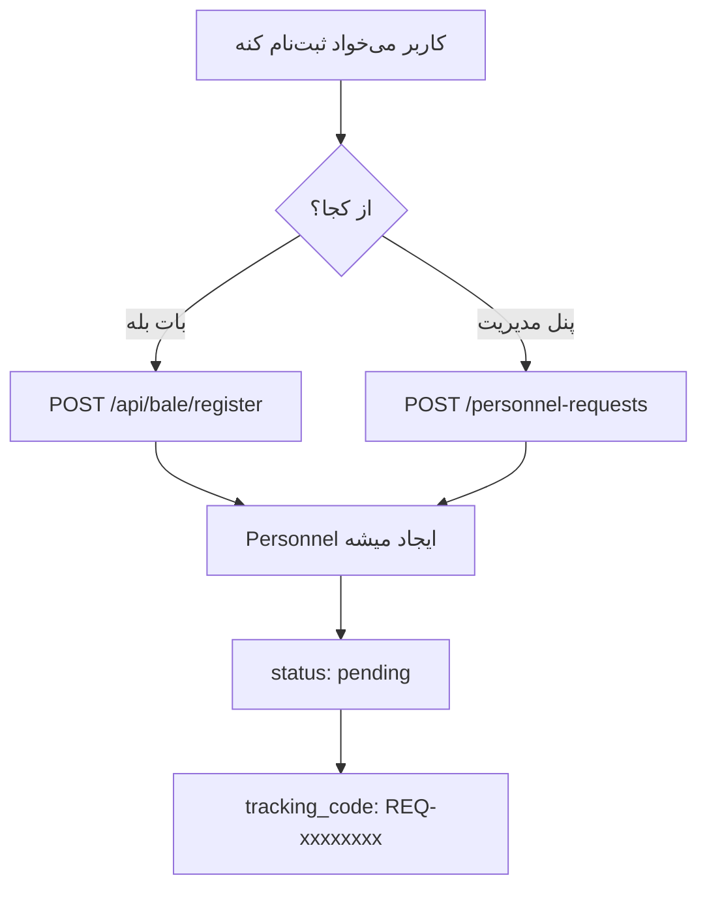
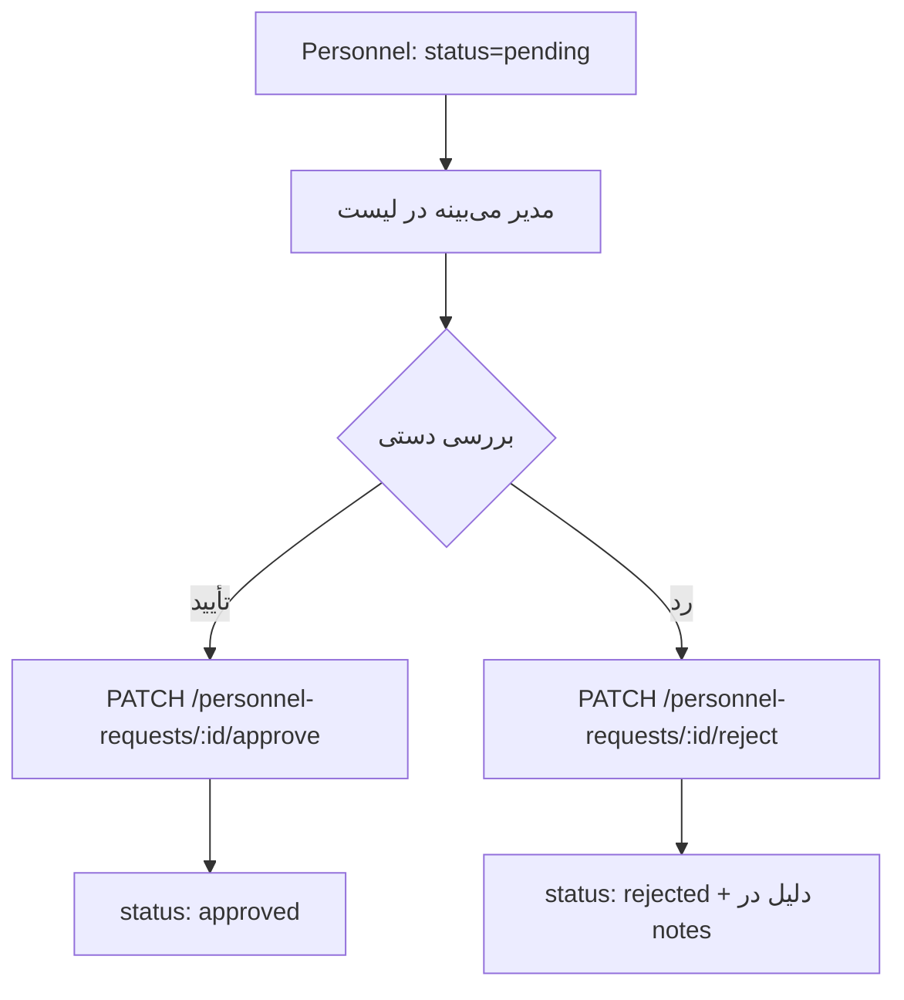
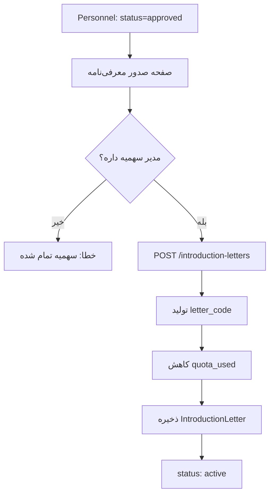

# Phase 1 Implementation Spec
## Simple Introduction Letter System without Lottery

**Date**: 2026-02-09
**Status**: ✅ Implemented
**Version**: 1.1.0-phase1

---

## Overview

این specification مربوط به فاز 1 سامانه رفاهی است که **بدون قرعه‌کشی** و با تأیید دستی کارفرما کار می‌کند.

### هدف:
صدور ساده معرفی‌نامه برای پرسنل بانک ملی بدون نیاز به سیستم پیچیده قرعه‌کشی و امتیازدهی.

### تغییرات اصلی نسبت به طرح اولیه:
- ❌ حذف سیستم قرعه‌کشی
- ❌ حذف الگوریتم امتیازدهی اولویت
- ❌ حذف قانون 3 سال (موقت)
- ✅ اضافه شدن self-registration از بات بله
- ✅ اضافه شدن سیستم سهمیه‌بندی شخصی
- ✅ تأیید دستی قبل از صدور

---

## Architecture

### Database Schema

#### 1. Personnel (Modified)
```sql
CREATE TABLE personnel (
    -- Existing fields...

    -- New fields for Phase 1:
    status ENUM('pending', 'approved', 'rejected') DEFAULT 'pending',
    registration_source ENUM('manual', 'bale_bot', 'web') DEFAULT 'manual',
    preferred_center_id BIGINT REFERENCES centers(id),
    notes TEXT,
    tracking_code VARCHAR(20) UNIQUE,

    -- Made nullable:
    province_id BIGINT NULLABLE,
    employee_code VARCHAR(20) NULLABLE
);
```

#### 2. IntroductionLetters (New)
```sql
CREATE TABLE introduction_letters (
    id BIGSERIAL PRIMARY KEY,
    letter_code VARCHAR(30) UNIQUE NOT NULL,
    personnel_id BIGINT REFERENCES personnel(id),
    center_id BIGINT REFERENCES centers(id),
    issued_by_user_id BIGINT REFERENCES users(id),

    family_count INTEGER DEFAULT 1,
    notes TEXT,

    valid_from VARCHAR(10),
    valid_until VARCHAR(10),
    issued_at TIMESTAMP,
    used_at TIMESTAMP,

    status ENUM('active', 'used', 'cancelled', 'expired') DEFAULT 'active',
    cancellation_reason TEXT,
    cancelled_by_user_id BIGINT REFERENCES users(id),
    cancelled_at TIMESTAMP,

    created_at TIMESTAMP,
    updated_at TIMESTAMP,

    INDEX (letter_code),
    INDEX (status),
    INDEX (issued_at)
);
```

#### 3. Users (Modified)
```sql
ALTER TABLE users ADD COLUMNS (
    quota_total INTEGER DEFAULT 0,
    quota_used INTEGER DEFAULT 0,
    quota_remaining INTEGER GENERATED ALWAYS AS (quota_total - quota_used) VIRTUAL,
    province_id BIGINT REFERENCES provinces(id)
);
```

---

## Workflow

### 1. Registration Flow



#### 1.1 From Bale Bot
**Endpoint**: `POST /api/bale/register`

**Request**:
```json
{
  "full_name": "علی احمدی",
  "national_code": "1234567890",
  "phone": "09123456789",
  "family_count": 4,
  "preferred_center_id": 1,
  "bale_user_id": "optional"
}
```

**Response**:
```json
{
  "success": true,
  "message": "درخواست شما با موفقیت ثبت شد",
  "data": {
    "tracking_code": "REQ-A1B2C3D4",
    "full_name": "علی احمدی",
    "national_code": "1234567890",
    "family_count": 4,
    "preferred_center": "زائرسرای مشهد مقدس",
    "status": "در انتظار بررسی",
    "registered_at": "1404/11/20 11:15"
  }
}
```

**Validation Rules**:
- `full_name`: required, string, max:255
- `national_code`: required, string, size:10, unique
- `phone`: required, string, max:20
- `family_count`: required, integer, min:1, max:10
- `preferred_center_id`: required, exists:centers,id

#### 1.2 Manual Registration
**Route**: `/personnel-requests/create`
**Method**: GET → Show form, POST → Store

Same validation as Bale bot, plus:
- `province_id`: nullable, exists:provinces,id
- `notes`: nullable, string, max:1000

---

### 2. Review & Approval Flow



**Approve Endpoint**: `PATCH /personnel-requests/{id}/approve`

**Response**:
```json
{
  "success": true,
  "message": "درخواست تأیید شد",
  "data": {
    "id": 123,
    "status": "approved",
    "updated_at": "1404/11/20 11:30"
  }
}
```

**Reject Endpoint**: `PATCH /personnel-requests/{id}/reject`

**Request**:
```json
{
  "rejection_reason": "اطلاعات ناقص است"
}
```

---

### 3. Letter Issuance Flow



**Endpoint**: `POST /introduction-letters`

**Request**:
```json
{
  "personnel_id": 123,
  "center_id": 1,
  "family_count": 4,
  "notes": "optional"
}
```

**Letter Code Generation**:
```
Format: {CENTER}-{YEAR}{MONTH}-{SEQUENCE}
Example: MHD-0411-0001
         BAB-0411-0002
         CHA-0411-0003
```

**Business Rules**:
1. ✅ Check user has quota available
2. ✅ Personnel must be approved
3. ✅ Generate unique letter code
4. ✅ Decrement user quota
5. ✅ Save introduction letter
6. ✅ Return letter details

---

### 4. Check Status Flow

**Endpoint**: `POST /api/bale/check-status`

**Request**:
```json
{
  "identifier": "1234567890",
  "identifier_type": "national_code"  // or "tracking_code"
}
```

**Response (Pending)**:
```json
{
  "success": true,
  "data": {
    "tracking_code": "REQ-A1B2C3D4",
    "full_name": "علی احمدی",
    "status": "در انتظار بررسی",
    "status_code": "pending",
    "registered_at": "1404/11/20 11:15"
  }
}
```

**Response (Approved with Letter)**:
```json
{
  "success": true,
  "data": {
    "tracking_code": "REQ-A1B2C3D4",
    "full_name": "علی احمدی",
    "status": "تأیید شده",
    "status_code": "approved",
    "registered_at": "1404/11/20 11:15",
    "introduction_letter": {
      "letter_code": "MHD-0411-0001",
      "center": "زائرسرای مشهد مقدس",
      "family_count": 4,
      "issued_at": "1404/11/20 11:30",
      "status": "active"
    }
  }
}
```

**Response (Rejected)**:
```json
{
  "success": true,
  "data": {
    "tracking_code": "REQ-A1B2C3D4",
    "full_name": "علی احمدی",
    "status": "رد شده",
    "status_code": "rejected",
    "registered_at": "1404/11/20 11:15",
    "rejection_reason": "اطلاعات ناقص است"
  }
}
```

---

### 5. Letter Cancellation Flow

**Endpoint**: `PATCH /introduction-letters/{id}/cancel`

**Request**:
```json
{
  "cancellation_reason": "تغییر برنامه مسافرت"
}
```

**Business Rules**:
1. ✅ Only active letters can be cancelled
2. ✅ Increment user quota (return quota)
3. ✅ Update letter status to 'cancelled'
4. ✅ Record cancellation details

---

## Quota System

### Quota Management

**Initial Assignment**:
```php
$user = User::find(1);
$user->quota_total = 100;
$user->save();
```

**Check Availability**:
```php
if ($user->hasQuotaAvailable()) {
    // Issue letter
}
```

**Increment (on issuance)**:
```php
$user->incrementQuotaUsed();  // quota_used++
```

**Decrement (on cancellation)**:
```php
$user->decrementQuotaUsed();  // quota_used--
```

**Virtual Column**:
```sql
quota_remaining = quota_total - quota_used
```

---

## API Endpoints Summary

### Public (Bale Bot)
| Method | Endpoint | Description |
|--------|----------|-------------|
| GET | `/api/bale/centers` | لیست مراکز |
| POST | `/api/bale/register` | ثبت درخواست |
| POST | `/api/bale/check-status` | چک وضعیت |
| POST | `/api/bale/letters` | معرفی‌نامه‌های من |

### Web Panel (Admin)
| Method | Endpoint | Description |
|--------|----------|-------------|
| GET | `/personnel-requests` | لیست درخواست‌ها |
| GET | `/personnel-requests/create` | فرم ثبت |
| POST | `/personnel-requests` | ذخیره درخواست |
| GET | `/personnel-requests/{id}` | جزئیات |
| GET | `/personnel-requests/{id}/edit` | فرم ویرایش |
| PUT | `/personnel-requests/{id}` | به‌روزرسانی |
| PATCH | `/personnel-requests/{id}/approve` | تأیید |
| PATCH | `/personnel-requests/{id}/reject` | رد |
| DELETE | `/personnel-requests/{id}` | حذف |

### Introduction Letters
| Method | Endpoint | Description |
|--------|----------|-------------|
| GET | `/introduction-letters` | لیست |
| GET | `/introduction-letters/create` | فرم صدور |
| POST | `/introduction-letters` | صدور |
| GET | `/introduction-letters/{id}` | جزئیات |
| PATCH | `/introduction-letters/{id}/cancel` | لغو |
| PATCH | `/introduction-letters/{id}/mark-as-used` | استفاده شده |
| GET | `/introduction-letters/{id}/print` | چاپ PDF |

---

## Models & Relations

### Personnel
```php
// Relations
- province(): BelongsTo
- preferredCenter(): BelongsTo
- introductionLetters(): HasMany

// Scopes
- scopePending()
- scopeApproved()
- scopeRejected()
- scopeFromBaleBot()

// Methods
- static generateTrackingCode(): string
```

### IntroductionLetter
```php
// Relations
- personnel(): BelongsTo
- center(): BelongsTo
- issuedBy(): BelongsTo
- cancelledBy(): BelongsTo

// Scopes
- scopeActive()
- scopeUsed()
- scopeCancelled()
- scopeForCenter($centerId)

// Methods
- markAsUsed(): bool
- cancel($reason, $userId): bool
- isActive(): bool
- isUsed(): bool
- isCancelled(): bool
- static generateLetterCode(Center $center): string
```

### User
```php
// Relations
- introductionLetters(): HasMany
- province(): BelongsTo

// Methods
- getQuotaRemaining(): int
- hasQuotaAvailable($count = 1): bool
- incrementQuotaUsed($count = 1): bool
- decrementQuotaUsed($count = 1): bool
```

---

## Testing

### Unit Tests
```php
// PersonnelTest
- test_can_generate_tracking_code()
- test_status_scopes()

// IntroductionLetterTest
- test_can_generate_letter_code()
- test_can_mark_as_used()
- test_can_cancel_letter()

// UserTest
- test_quota_management()
- test_has_quota_available()
```

### API Tests
```php
// BaleRegistrationTest
- test_can_register_from_bale_bot()
- test_validation_rules()
- test_unique_national_code()
- test_tracking_code_generated()

// StatusCheckTest
- test_can_check_status_by_national_code()
- test_can_check_status_by_tracking_code()
- test_returns_letter_if_approved()

// LetterIssuanceTest
- test_can_issue_letter()
- test_cannot_issue_without_quota()
- test_quota_decremented_on_issue()
- test_letter_code_unique()
```

---

## Differences from Original Spec

| Feature | Original Spec | Phase 1 Implementation |
|---------|--------------|------------------------|
| قرعه‌کشی | ✅ Required | ❌ Removed |
| الگوریتم امتیازدهی | ✅ Complex scoring | ❌ Removed |
| ثبت‌نام | Pre-existing personnel | ✅ Self-registration |
| تأیید | After lottery | ✅ Before letter issuance |
| سهمیه | Provincial | ✅ Per-user |
| قانون 3 سال | ✅ Enforced | ❌ Disabled (temp) |
| تخصیص واحد | Automatic | ❌ Manual (for now) |

---

## Future Enhancements

### Phase 2 (Optional):
- ⬜ Automatic province assignment
- ⬜ HR system validation
- ⬜ SMS notifications
- ⬜ Date-limited letters
- ⬜ Advanced reporting

### Phase 3 (Optional):
- ⬜ Lottery system
- ⬜ Priority scoring algorithm
- ⬜ 3-year rule enforcement
- ⬜ Automatic unit assignment

---

## Implementation Status

| Component | Status | Notes |
|-----------|--------|-------|
| Migrations | ✅ Complete | 3 new migrations |
| Models | ✅ Complete | IntroductionLetter + updates |
| Controllers | ✅ Complete | 3 controllers |
| API Endpoints | ✅ Complete | 4 endpoints for Bale |
| Web Views | ⏳ Partial | index, show complete |
| Tests | ⬜ Todo | Need to write |
| Documentation | ✅ Complete | Full docs |

---

## References

- **PHASE1_README.md**: Full documentation
- **DEPLOYMENT_REPORT.md**: Deployment details
- **GitHub**: https://github.com/sedalcrazy-create/welfare

---

**Last Updated**: 2026-02-09
**Implemented By**: Claude Sonnet 4.5
**Status**: ✅ Ready for Testing
