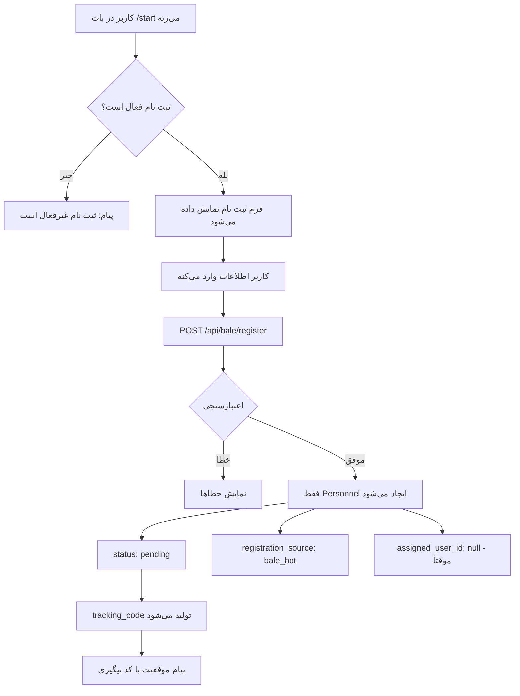
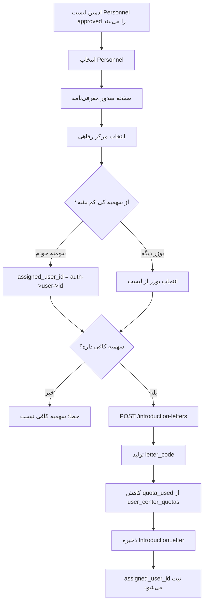
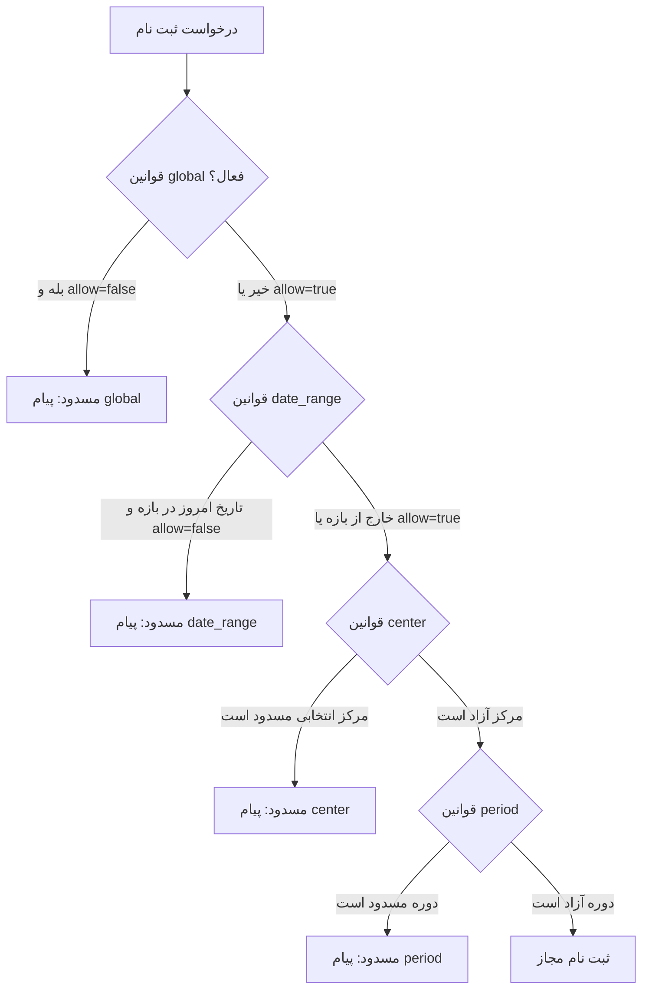

# Phase 1 Revised Specification
## Per-Center Quota System with Registration Control

**Date**: 2026-02-09
**Status**: 🔄 In Design
**Version**: 1.2.0-phase1-revised
**Previous Version**: 1.1.0-phase1

---

## 📋 Overview

این specification نسخه اصلاح شده فاز 1 است که **سیستم سهمیه‌بندی به تفکیک مرکز** و **کنترل ثبت نام** را پیاده‌سازی می‌کند.

### 🎯 اهداف اصلی:

1. **سهمیه به تفکیک مرکز**: هر کاربر (admin/operator) سهمیه جداگانه برای هر مرکز رفاهی داشته باشد
2. **جداسازی User از Personnel**: ثبت نام از Bale Bot نباید User ایجاد کند
3. **کنترل ثبت نام**: ادمین بتواند ثبت نام را برای تاریخ‌ها و دوره‌های خاص غیرفعال کند
4. **تخصیص به یوزر مشخص**: معرفی‌نامه‌های ثبت شده از بات از سهمیه یک یوزر مشخص کم شود

---

## 🔄 Changes from Previous Version (1.1.0)

| موضوع | نسخه قبلی | نسخه جدید |
|-------|-----------|----------|
| **سهمیه** | یک عدد کل برای همه مراکز | سهمیه جداگانه برای هر مرکز |
| **Bale Registration** | می‌ساخت User | فقط Personnel می‌سازد |
| **تخصیص سهمیه** | از سهمیه صادرکننده کم می‌شد | از سهمیه یوزر تعیین شده کم می‌شود |
| **کنترل ثبت نام** | همیشه فعال | قابل غیرفعال سازی برای تاریخ/دوره خاص |

---

## 🗄️ Database Schema Changes

### 1. New Table: `user_center_quotas`

```sql
CREATE TABLE user_center_quotas (
    id BIGSERIAL PRIMARY KEY,
    user_id BIGINT NOT NULL,
    center_id BIGINT NOT NULL,
    quota_total INTEGER DEFAULT 0 COMMENT 'تعداد کل سهمیه برای این مرکز',
    quota_used INTEGER DEFAULT 0 COMMENT 'تعداد استفاده شده',
    quota_remaining INTEGER GENERATED ALWAYS AS (quota_total - quota_used) STORED,
    created_at TIMESTAMP,
    updated_at TIMESTAMP,

    FOREIGN KEY (user_id) REFERENCES users(id) ON DELETE CASCADE,
    FOREIGN KEY (center_id) REFERENCES centers(id) ON DELETE CASCADE,

    UNIQUE KEY unique_user_center (user_id, center_id),
    INDEX idx_user_center (user_id, center_id)
);
```

**Example Data**:
```
| user_id | center_id | quota_total | quota_used | quota_remaining |
|---------|-----------|-------------|------------|-----------------|
| 1       | 1 (مشهد)  | 2           | 0          | 2               |
| 1       | 2 (بابلسر)| 3           | 1          | 2               |
| 1       | 3 (چادگان)| 2           | 0          | 2               |
| 2       | 1 (مشهد)  | 5           | 2          | 3               |
```

---

### 2. New Table: `registration_controls`

```sql
CREATE TABLE registration_controls (
    id BIGSERIAL PRIMARY KEY,
    rule_type ENUM('date_range', 'center', 'period', 'global') NOT NULL,
    is_active BOOLEAN DEFAULT TRUE,

    -- Date range control
    start_date VARCHAR(10) NULLABLE COMMENT 'YYYY-MM-DD Jalali',
    end_date VARCHAR(10) NULLABLE COMMENT 'YYYY-MM-DD Jalali',

    -- Center/Period control
    center_id BIGINT NULLABLE,
    period_id BIGINT NULLABLE,

    -- Settings
    allow_registration BOOLEAN DEFAULT TRUE,
    message TEXT COMMENT 'پیام نمایش داده شده به کاربر',

    -- Metadata
    created_by_user_id BIGINT,
    created_at TIMESTAMP,
    updated_at TIMESTAMP,

    FOREIGN KEY (center_id) REFERENCES centers(id) ON DELETE CASCADE,
    FOREIGN KEY (period_id) REFERENCES periods(id) ON DELETE CASCADE,
    FOREIGN KEY (created_by_user_id) REFERENCES users(id) ON DELETE SET NULL,

    INDEX idx_rule_type (rule_type),
    INDEX idx_active (is_active),
    INDEX idx_dates (start_date, end_date),
    INDEX idx_center (center_id)
);
```

**Example Data**:
```
| rule_type   | start_date | end_date   | center_id | allow_registration | message |
|-------------|------------|------------|-----------|-------------------|---------|
| date_range  | 1404-12-01 | 1404-12-15 | null      | false             | ثبت نام تا 15 اسفند بسته است |
| center      | null       | null       | 1         | false             | ثبت نام برای مشهد موقتاً غیرفعال است |
| period      | null       | null       | null      | false             | دوره مورد نظر پر شده است |
```

---

### 3. Modified Table: `introduction_letters`

```sql
ALTER TABLE introduction_letters
ADD COLUMN assigned_user_id BIGINT NULLABLE COMMENT 'یوزری که از سهمیه‌اش کم شده',
ADD FOREIGN KEY (assigned_user_id) REFERENCES users(id) ON DELETE SET NULL,
ADD INDEX idx_assigned_user (assigned_user_id);
```

**توضیح**:
- `issued_by_user_id`: کسی که معرفی‌نامه رو صادر کرده (ادمینی که روی دکمه زده)
- `assigned_user_id`: کسی که سهمیه‌اش کم شده (ممکنه با issued_by متفاوت باشه)

---

### 4. Settings Table Addition

```sql
ALTER TABLE settings
ADD COLUMN default_quota_user_id BIGINT NULLABLE COMMENT 'یوزر پیش‌فرض برای ثبت نام‌های بات',
ADD FOREIGN KEY (default_quota_user_id) REFERENCES users(id) ON DELETE SET NULL;
```

یا می‌تونیم از یک config ساده استفاده کنیم:
```php
// config/welfare.php
'phase1' => [
    'default_quota_user_id' => env('DEFAULT_QUOTA_USER_ID', 1),
    'allow_bale_registration' => env('ALLOW_BALE_REGISTRATION', true),
],
```

---

## 🔄 Updated Workflows

### 1. Registration from Bale Bot (Revised)



**Important Changes**:
- ✅ **هیچ User ساخته نمی‌شود**
- ✅ فقط یک رکورد Personnel ثبت می‌شود
- ✅ `assigned_user_id` در این مرحله null است

---

### 2. Letter Issuance (Revised)



**Business Rules**:
1. ✅ Check `user_center_quotas` for specific center
2. ✅ Admin can choose which user's quota to use
3. ✅ Default: use admin's own quota
4. ✅ Record `assigned_user_id` in letter

---

### 3. Registration Control Check



**Priority Order**:
1. Global rules (highest priority)
2. Date range rules
3. Center-specific rules
4. Period-specific rules (lowest priority)

---

## 📝 New Models

### 1. UserCenterQuota Model

```php
<?php

namespace App\Models;

use Illuminate\Database\Eloquent\Model;
use Illuminate\Database\Eloquent\Relations\BelongsTo;

class UserCenterQuota extends Model
{
    protected $fillable = [
        'user_id',
        'center_id',
        'quota_total',
        'quota_used',
    ];

    protected $casts = [
        'quota_total' => 'integer',
        'quota_used' => 'integer',
    ];

    // Relations
    public function user(): BelongsTo
    {
        return $this->belongsTo(User::class);
    }

    public function center(): BelongsTo
    {
        return $this->belongsTo(Center::class);
    }

    // Methods
    public function hasAvailable(int $count = 1): bool
    {
        return $this->quota_remaining >= $count;
    }

    public function incrementUsed(int $count = 1): bool
    {
        $this->increment('quota_used', $count);
        return true;
    }

    public function decrementUsed(int $count = 1): bool
    {
        if ($this->quota_used >= $count) {
            $this->decrement('quota_used', $count);
            return true;
        }
        return false;
    }

    // Accessor
    public function getQuotaRemainingAttribute(): int
    {
        return $this->quota_total - $this->quota_used;
    }

    // Scopes
    public function scopeForUser($query, int $userId)
    {
        return $query->where('user_id', $userId);
    }

    public function scopeForCenter($query, int $centerId)
    {
        return $query->where('center_id', $centerId);
    }

    public function scopeHasAvailable($query)
    {
        return $query->whereRaw('quota_total > quota_used');
    }
}
```

---

### 2. RegistrationControl Model

```php
<?php

namespace App\Models;

use Illuminate\Database\Eloquent\Model;
use Illuminate\Database\Eloquent\Relations\BelongsTo;
use Carbon\Carbon;

class RegistrationControl extends Model
{
    protected $fillable = [
        'rule_type',
        'is_active',
        'start_date',
        'end_date',
        'center_id',
        'period_id',
        'allow_registration',
        'message',
        'created_by_user_id',
    ];

    protected $casts = [
        'is_active' => 'boolean',
        'allow_registration' => 'boolean',
    ];

    // Relations
    public function center(): BelongsTo
    {
        return $this->belongsTo(Center::class);
    }

    public function period(): BelongsTo
    {
        return $this->belongsTo(Period::class);
    }

    public function createdBy(): BelongsTo
    {
        return $this->belongsTo(User::class, 'created_by_user_id');
    }

    // Scopes
    public function scopeActive($query)
    {
        return $query->where('is_active', true);
    }

    public function scopeGlobal($query)
    {
        return $query->where('rule_type', 'global');
    }

    public function scopeDateRange($query)
    {
        return $query->where('rule_type', 'date_range');
    }

    public function scopeForCenter($query, int $centerId)
    {
        return $query->where('rule_type', 'center')
                     ->where('center_id', $centerId);
    }

    public function scopeForPeriod($query, int $periodId)
    {
        return $query->where('rule_type', 'period')
                     ->where('period_id', $periodId);
    }

    // Methods
    public static function isRegistrationAllowed(?int $centerId = null, ?int $periodId = null): array
    {
        // Check global rules
        $global = self::active()->global()->first();
        if ($global && !$global->allow_registration) {
            return [
                'allowed' => false,
                'message' => $global->message ?? 'ثبت نام در حال حاضر غیرفعال است',
                'rule_type' => 'global'
            ];
        }

        // Check date range rules
        $today = jdate()->format('Y-m-d');
        $dateRules = self::active()
            ->dateRange()
            ->where('start_date', '<=', $today)
            ->where('end_date', '>=', $today)
            ->where('allow_registration', false)
            ->first();

        if ($dateRules) {
            return [
                'allowed' => false,
                'message' => $dateRules->message ?? 'ثبت نام در این بازه زمانی غیرفعال است',
                'rule_type' => 'date_range'
            ];
        }

        // Check center rules
        if ($centerId) {
            $centerRule = self::active()
                ->forCenter($centerId)
                ->where('allow_registration', false)
                ->first();

            if ($centerRule) {
                return [
                    'allowed' => false,
                    'message' => $centerRule->message ?? 'ثبت نام برای این مرکز غیرفعال است',
                    'rule_type' => 'center'
                ];
            }
        }

        // Check period rules
        if ($periodId) {
            $periodRule = self::active()
                ->forPeriod($periodId)
                ->where('allow_registration', false)
                ->first();

            if ($periodRule) {
                return [
                    'allowed' => false,
                    'message' => $periodRule->message ?? 'ثبت نام برای این دوره غیرفعال است',
                    'rule_type' => 'period'
                ];
            }
        }

        return [
            'allowed' => true,
            'message' => null,
            'rule_type' => null
        ];
    }
}
```

---

## 🔌 Updated API Endpoints

### 1. Bale Registration (Modified)

**Endpoint**: `POST /api/bale/register`

**Request**:
```json
{
  "full_name": "علی احمدی",
  "national_code": "1234567890",
  "phone": "09123456789",
  "family_count": 4,
  "preferred_center_id": 1
}
```

**Response (Success)**:
```json
{
  "success": true,
  "message": "درخواست شما با موفقیت ثبت شد",
  "data": {
    "tracking_code": "REQ-A1B2C3D4",
    "full_name": "علی احمدی",
    "national_code": "1234567890",
    "family_count": 4,
    "preferred_center": "زائرسرای مشهد مقدس",
    "status": "در انتظار بررسی",
    "registered_at": "1404/11/20 11:15"
  }
}
```

**Response (Registration Blocked)**:
```json
{
  "success": false,
  "message": "ثبت نام تا 15 اسفند بسته است",
  "error_code": "REGISTRATION_BLOCKED",
  "rule_type": "date_range"
}
```

**Controller Logic**:
```php
public function register(Request $request)
{
    // Check registration control
    $check = RegistrationControl::isRegistrationAllowed(
        $request->preferred_center_id
    );

    if (!$check['allowed']) {
        return response()->json([
            'success' => false,
            'message' => $check['message'],
            'error_code' => 'REGISTRATION_BLOCKED',
            'rule_type' => $check['rule_type']
        ], 403);
    }

    // Validate
    $validated = $request->validate([
        'full_name' => 'required|string|max:255',
        'national_code' => 'required|string|size:10|unique:personnel,national_code',
        'phone' => 'required|string|max:20',
        'family_count' => 'required|integer|min:1|max:10',
        'preferred_center_id' => 'required|exists:centers,id',
    ]);

    // Create Personnel ONLY (no User creation)
    $personnel = Personnel::create([
        'full_name' => $validated['full_name'],
        'national_code' => $validated['national_code'],
        'phone' => $validated['phone'],
        'family_count' => $validated['family_count'],
        'preferred_center_id' => $validated['preferred_center_id'],
        'registration_source' => 'bale_bot',
        'status' => 'pending',
        'tracking_code' => Personnel::generateTrackingCode(),
    ]);

    return response()->json([
        'success' => true,
        'message' => 'درخواست شما با موفقیت ثبت شد',
        'data' => [
            'tracking_code' => $personnel->tracking_code,
            'full_name' => $personnel->full_name,
            'national_code' => $personnel->national_code,
            'family_count' => $personnel->family_count,
            'preferred_center' => $personnel->preferredCenter->name,
            'status' => 'در انتظار بررسی',
            'registered_at' => jdate($personnel->created_at)->format('Y/m/d H:i')
        ]
    ]);
}
```

---

### 2. Letter Issuance (Modified)

**Endpoint**: `POST /introduction-letters`

**Request**:
```json
{
  "personnel_id": 123,
  "center_id": 1,
  "family_count": 4,
  "assigned_user_id": 2,
  "notes": "optional"
}
```

**Validation**:
```php
$request->validate([
    'personnel_id' => 'required|exists:personnel,id',
    'center_id' => 'required|exists:centers,id',
    'family_count' => 'required|integer|min:1|max:10',
    'assigned_user_id' => 'nullable|exists:users,id',
    'notes' => 'nullable|string|max:1000',
]);
```

**Controller Logic**:
```php
public function store(Request $request)
{
    $validated = $request->validate([...]);

    // Determine assigned user
    $assignedUserId = $validated['assigned_user_id'] ?? auth()->id();
    $assignedUser = User::findOrFail($assignedUserId);

    // Check quota for specific center
    $quota = UserCenterQuota::where('user_id', $assignedUserId)
        ->where('center_id', $validated['center_id'])
        ->first();

    if (!$quota || !$quota->hasAvailable()) {
        return back()->withErrors([
            'quota' => 'سهمیه کافی برای این مرکز وجود ندارد'
        ]);
    }

    // Check personnel is approved
    $personnel = Personnel::findOrFail($validated['personnel_id']);
    if ($personnel->status !== 'approved') {
        return back()->withErrors([
            'personnel' => 'درخواست پرسنل باید تأیید شده باشد'
        ]);
    }

    DB::beginTransaction();
    try {
        // Generate letter code
        $center = Center::findOrFail($validated['center_id']);
        $letterCode = IntroductionLetter::generateLetterCode($center);

        // Create letter
        $letter = IntroductionLetter::create([
            'letter_code' => $letterCode,
            'personnel_id' => $validated['personnel_id'],
            'center_id' => $validated['center_id'],
            'issued_by_user_id' => auth()->id(),
            'assigned_user_id' => $assignedUserId,
            'family_count' => $validated['family_count'],
            'notes' => $validated['notes'],
            'issued_at' => now(),
            'status' => 'active',
        ]);

        // Decrement quota
        $quota->incrementUsed();

        DB::commit();

        return redirect()
            ->route('introduction-letters.show', $letter)
            ->with('success', 'معرفی‌نامه با موفقیت صادر شد');

    } catch (\Exception $e) {
        DB::rollBack();
        return back()->withErrors(['error' => 'خطا در صدور معرفی‌نامه']);
    }
}
```

---

### 3. Cancel Letter (Modified)

**Changes**: When cancelling, return quota to `assigned_user_id`, not `issued_by_user_id`

```php
public function cancel(Request $request, IntroductionLetter $introductionLetter)
{
    if (!$introductionLetter->isActive()) {
        return back()->withErrors(['error' => 'فقط معرفی‌نامه‌های فعال قابل لغو هستند']);
    }

    $validated = $request->validate([
        'cancellation_reason' => 'required|string|max:1000',
    ]);

    DB::beginTransaction();
    try {
        // Return quota to assigned user
        $quota = UserCenterQuota::where('user_id', $introductionLetter->assigned_user_id)
            ->where('center_id', $introductionLetter->center_id)
            ->first();

        if ($quota) {
            $quota->decrementUsed();
        }

        // Update letter
        $introductionLetter->update([
            'status' => 'cancelled',
            'cancellation_reason' => $validated['cancellation_reason'],
            'cancelled_by_user_id' => auth()->id(),
            'cancelled_at' => now(),
        ]);

        DB::commit();

        return redirect()
            ->route('introduction-letters.show', $introductionLetter)
            ->with('success', 'معرفی‌نامه لغو شد و سهمیه بازگردانده شد');

    } catch (\Exception $e) {
        DB::rollBack();
        return back()->withErrors(['error' => 'خطا در لغو معرفی‌نامه']);
    }
}
```

---

## 🎨 Admin Panel Pages

### 1. User Quota Management (Per Center)

**Route**: `/admin/user-quota`

**Features**:
- نمایش لیست کاربران
- برای هر کاربر، نمایش سهمیه‌های به تفکیک مرکز
- امکان ویرایش سهمیه هر مرکز جداگانه
- نمایش total, used, remaining برای هر مرکز

**UI Mockup**:
```
┌──────────────────────────────────────────────┐
│ مدیریت سهمیه کاربران                        │
├──────────────────────────────────────────────┤
│ کارشناس رفاه (welfare@bankmelli.ir)         │
│                                              │
│ ┌──────────────────────────────────────────┐ │
│ │ مشهد:    کل: 2  استفاده: 0  باقی: 2 [ویرایش] │
│ │ بابلسر:   کل: 3  استفاده: 1  باقی: 2 [ویرایش] │
│ │ چادگان:  کل: 2  استفاده: 0  باقی: 2 [ویرایش] │
│ └──────────────────────────────────────────┘ │
├──────────────────────────────────────────────┤
│ اپراتور (operator@bankmelli.ir)             │
│ ...                                          │
└──────────────────────────────────────────────┘
```

---

### 2. Registration Control Management

**Route**: `/admin/registration-control`

**Features**:
- افزودن قانون جدید (global, date_range, center, period)
- فعال/غیرفعال کردن قوانین
- ویرایش پیام نمایشی
- حذف قوانین

**UI Mockup**:
```
┌──────────────────────────────────────────────┐
│ کنترل ثبت نام                                │
│ [+ افزودن قانون جدید]                       │
├──────────────────────────────────────────────┤
│ ☑ Global: ثبت نام غیرفعال                   │
│   پیام: "سیستم در حال تعمیر است"            │
│   [ویرایش] [حذف]                            │
├──────────────────────────────────────────────┤
│ ☑ بازه زمانی: 1404/12/01 - 1404/12/15      │
│   پیام: "ثبت نام تا 15 اسفند بسته است"      │
│   [ویرایش] [حذف]                            │
├──────────────────────────────────────────────┤
│ ☑ مرکز: مشهد                                │
│   پیام: "ظرفیت مشهد تکمیل است"              │
│   [ویرایش] [حذف]                            │
└──────────────────────────────────────────────┘
```

---

### 3. Letter Issuance Form (Modified)

**Route**: `/introduction-letters/create`

**Added Field**: User Selection

```
┌──────────────────────────────────────────────┐
│ صدور معرفی‌نامه جدید                         │
├──────────────────────────────────────────────┤
│ پرسنل: [انتخاب از لیست approved]           │
│ مرکز: [انتخاب مرکز]                         │
│ تعداد خانواده: [4]                          │
│                                              │
│ از سهمیه کی کم بشه؟                         │
│ ○ سهمیه خودم                                 │
│   مشهد: 2 باقیمانده ✓                      │
│                                              │
│ ● یوزر دیگه: [انتخاب کاربر]                │
│   کارشناس رفاه - مشهد: 2 باقیمانده ✓       │
│                                              │
│ [صدور معرفی‌نامه]                            │
└──────────────────────────────────────────────┘
```

---

## 📊 Reports & Analytics

### 1. Quota Usage Report

**Route**: `/reports/quota-usage`

**Data**:
```
| کاربر | مرکز | کل | استفاده | باقیمانده | درصد استفاده |
|-------|------|-----|---------|-----------|--------------|
| کارشناس | مشهد | 2 | 0 | 2 | 0% |
| کارشناس | بابلسر | 3 | 1 | 2 | 33% |
| کارشناس | چادگان | 2 | 0 | 2 | 0% |
```

### 2. Registration Statistics

**Route**: `/reports/registration-stats`

**Data**:
- تعداد ثبت نام از بات
- تعداد ثبت نام دستی
- تعداد تأیید شده / رد شده
- آمار به تفکیک منبع و مرکز

---

## 🧪 Testing Scenarios

### Test 1: Per-Center Quota
```php
// Setup
$user = User::factory()->create();
$mashhad = Center::where('name', 'مشهد')->first();
$babolsar = Center::where('name', 'بابلسر')->first();

UserCenterQuota::create([
    'user_id' => $user->id,
    'center_id' => $mashhad->id,
    'quota_total' => 2,
    'quota_used' => 0,
]);

UserCenterQuota::create([
    'user_id' => $user->id,
    'center_id' => $babolsar->id,
    'quota_total' => 3,
    'quota_used' => 0,
]);

// Test
$this->assertTrue($user->hasQuotaForCenter($mashhad->id, 2));
$this->assertTrue($user->hasQuotaForCenter($babolsar->id, 3));
$this->assertFalse($user->hasQuotaForCenter($mashhad->id, 3));
```

### Test 2: Registration Control
```php
// Block registration globally
RegistrationControl::create([
    'rule_type' => 'global',
    'is_active' => true,
    'allow_registration' => false,
    'message' => 'ثبت نام غیرفعال است',
]);

// Attempt registration
$response = $this->postJson('/api/bale/register', [
    'full_name' => 'علی احمدی',
    'national_code' => '1234567890',
    // ...
]);

$response->assertStatus(403)
    ->assertJson([
        'success' => false,
        'error_code' => 'REGISTRATION_BLOCKED',
    ]);
```

### Test 3: Bale Registration No User Creation
```php
$initialUserCount = User::count();

$response = $this->postJson('/api/bale/register', [
    'full_name' => 'علی احمدی',
    'national_code' => '1234567890',
    'phone' => '09123456789',
    'family_count' => 4,
    'preferred_center_id' => 1,
]);

$response->assertSuccessful();

// Assert NO new user created
$this->assertEquals($initialUserCount, User::count());

// Assert Personnel created
$this->assertDatabaseHas('personnel', [
    'national_code' => '1234567890',
    'registration_source' => 'bale_bot',
    'status' => 'pending',
]);
```

---

## 🚀 Migration Plan

### Step 1: Create New Tables
```bash
php artisan make:migration create_user_center_quotas_table
php artisan make:migration create_registration_controls_table
php artisan migrate
```

### Step 2: Migrate Existing Data
```php
// Migrate old quota_total to per-center quotas
$users = User::where('quota_total', '>', 0)->get();
$centers = Center::all();

foreach ($users as $user) {
    foreach ($centers as $center) {
        UserCenterQuota::create([
            'user_id' => $user->id,
            'center_id' => $center->id,
            'quota_total' => $user->quota_total, // Same for all centers initially
            'quota_used' => 0,
        ]);
    }
}
```

### Step 3: Update Models & Controllers

### Step 4: Update Views

### Step 5: Test Thoroughly

### Step 6: Deploy

---

## 📚 Configuration

### config/welfare.php
```php
'phase1' => [
    // Default user for Bale bot registrations
    'default_quota_user_id' => env('DEFAULT_QUOTA_USER_ID', 1),

    // Enable/disable Bale registration
    'allow_bale_registration' => env('ALLOW_BALE_REGISTRATION', true),

    // Tracking code format
    'tracking_code_prefix' => 'REQ',
    'tracking_code_length' => 8,

    // Letter code format
    'letter_code_format' => '{CENTER}-{YEAR}{MONTH}-{SEQUENCE}',
],
```

---

## ✅ Implementation Checklist

- [ ] Create `user_center_quotas` migration
- [ ] Create `registration_controls` migration
- [ ] Modify `introduction_letters` table (add assigned_user_id)
- [ ] Create `UserCenterQuota` model
- [ ] Create `RegistrationControl` model
- [ ] Update `User` model (add relations & methods)
- [ ] Update `IntroductionLetter` model (add assignedUser relation)
- [ ] Update BaleController (remove User creation logic)
- [ ] Update IntroductionLetterController (add user selection)
- [ ] Create `Admin/UserCenterQuotaController`
- [ ] Create `Admin/RegistrationControlController`
- [ ] Create user-center-quota views
- [ ] Create registration-control views
- [ ] Update letter issuance form (add user selection)
- [ ] Write unit tests
- [ ] Write feature tests
- [ ] Update documentation
- [ ] Deploy to staging
- [ ] Test end-to-end
- [ ] Deploy to production

---

## 🎯 Success Criteria

1. ✅ هر کاربر سهمیه جداگانه برای هر مرکز دارد
2. ✅ ثبت نام از Bale Bot هیچ User ایجاد نمی‌کند
3. ✅ ادمین می‌تواند ثبت نام را کنترل کند
4. ✅ معرفی‌نامه‌ها به یوزر مشخص assign می‌شوند
5. ✅ سهمیه به درستی کم و زیاد می‌شود

---

**End of Specification**
**Last Updated**: 2026-02-09
**Status**: 🔄 Ready for Implementation
